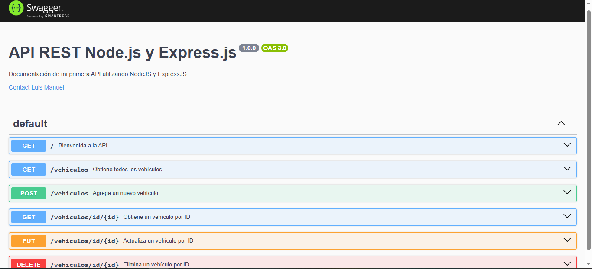

# ⚙️ API REST con Node.js y Express.js

**API REST para Gestión de Vehículos | Desarrollo Backend**

## 💡 Objetivo del Proyecto

Desarrollar una API REST completa que permite la gestión de información de vehículos, implementando operaciones CRUD (Crear, Leer, Actualizar y Eliminar) utilizando Node.js y Express.js. Los datos se persisten en un archivo JSON, simulando una base de datos.

**📌 Nota**: Este proyecto demuestra la implementación de una API REST siguiendo las mejores prácticas de desarrollo y documentación con Swagger.

---

## 🔧 Tecnologías Utilizadas

- Node.js
- Express.js
- Swagger UI Express
- Body Parser
- File System (fs)

## ⭐️ Características Principales

1. 📊 **CRUD Completo**: Operaciones completas para gestión de vehículos
2. 📖 **Documentación Swagger**: API completamente documentada
3. 💾 **Persistencia de Datos**: Almacenamiento en archivo JSON
4. 🔎 **Búsqueda por ID**: Endpoint específico para consultas individuales
5. 📤 **Respuestas HTTP**: Manejo apropiado de códigos de estado
6. ✅ **Validación de Datos**: Verificación de información entrante

---

## 🌐 Endpoints Disponibles

1. Obtener Todos los Vehículos

```bash
http
GET /vehiculos
```

2. **Obtener Vehículo por ID**

```bash
GET /vehiculos/id/:id
```

3. **Crear Nuevo Vehículo**

```bash
POST /vehiculos
```

4. **Actualizar Vehículo**

```bash
PUT /vehiculos/id/:id
```

5. **Eliminar Vehículo**

```bash
DELETE /vehiculos/id/:id
```

## 📋 Estructura de Datos

```bash
{
  "id": 1,
  "anio": 2024,
  "marca": "Honda",
  "modelo": "Civic",
  "color": "Rojo",
  "tipo": "Coupe",
  "kilometraje": 31000,
  "combustible": "Gasolina",
  "transmision": "Manual",
  "precio": 18000,
  "numero_de_puertas": 2,
  "numero_de_asientos": 2
}

```

## ⚡️ Instalación y Uso

## ⚠️ Requisitos Previos
- Node.js (versión 14 o superior)
- npm (gestor de paquetes de Node.js)
- Docker y Docker Compose (opcional, para despliegue containerizado)

### 🔨 Pasos de Instalación

#### Método Tradicional

1. **Clonar el Repositorio**

```bash
git clone https://github.com/luismanuelcldev/APIREST_NodejsExpressjs_CRUD.git
cd APIREST_NodejsExpressjs_CRUD
```

2. **Instalar Dependencias**

```bash
npm install
```

3. **Iniciar el Servidor**

```bash
node index.js
```
o

```bash
npm run dev
```

El servidor se iniciará en http://localhost:3000

#### Usando Docker 🐳

1. **Construir y ejecutar con Docker Compose**

```bash
docker-compose up -d
```

2. **Verificar los contenedores en ejecución**

```bash
docker-compose ps
```

3. **Detener los contenedores**

```bash
docker-compose down
```

El servidor API estará disponible en http://localhost:3000
La documentación Swagger estará disponible en http://localhost:8080

## 📚 Documentación



```bash
http://localhost:3000/api-docs
```

## 🗂️ Estructura del Proyecto

├── index.js            # Punto de entrada de la aplicación
├── db.json             # Archivo de base de datos
├── requests.http       # Ejemplos de peticiones HTTP
├── package.json        # Dependencias y configuración
├── Dockerfile          # Configuración para construir la imagen Docker
├── docker-compose.yml  # Configuración de servicios Docker
├── .dockerignore       # Archivos ignorados en la construcción de Docker
└── README.md           # Documentación

## 👨‍💻 Desarrollador

- **Luis Manuel De la Cruz Ledesma**
- **📧 Email:** ledesmadelacruzluismanuel@gmail.com

---

## 💻 Ejemplos de Uso

### Crear un Nuevo Vehículo

```bash
POST http://localhost:3000/vehiculos
Content-Type: application/json

{
  "anio": 2026,
  "marca": "Honda",
  "modelo": "Civic",
  "color": "Rojo",
  "tipo": "Coupe",
  "kilometraje": 25000,
  "combustible": "Gasolina",
  "transmision": "Manual",
  "precio": 18000,
  "numero_de_puertas": 2,
  "numero_de_asientos": 2
}
```

### Actualizar un Vehículo

```bash
PUT http://localhost:3000/vehiculos/id/1
Content-Type: application/json

{
  "precio": 33000
}
```
---

## 📄 Licencia
Este proyecto está bajo la Licencia MIT - vea el archivo LICENSE.md para más detalles

---

⭐️ Si encuentras útil este proyecto, ¡no olvides darle una estrella en GitHub! ⭐️

